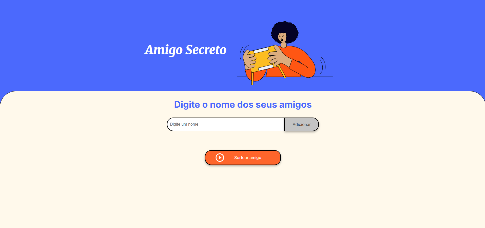

# Projeto Amigo Secreto 🎁

Este é um projeto simples e divertido para realizar sorteios de Amigo Secreto online. O foco principal do desafio foi o desenvolvimento da lógica de programação em JavaScript puro, aplicando conceitos como manipulação do DOM, arrays, funções e condicionais.

## 💻 Demonstração



## ✨ Funcionalidades

-   **Adicionar Participantes**: Adicione os nomes de todos os amigos que participarão da brincadeira.
-   **Validação de Entrada**: O sistema impede a adição de nomes em branco ou duplicados para garantir a integridade do sorteio.
-   **Sorteio Aleatório**: Com um clique, o sistema embaralha os nomes e define os pares (quem presenteia quem).
-   **Exibição de Resultados**: Mostra a lista completa dos pares sorteados, garantindo que ninguém tire a si mesmo e que todos sejam incluídos no ciclo de presentes.

## 🚀 Tecnologias Utilizadas

O projeto foi desenvolvido utilizando as seguintes tecnologias:

-   **HTML5**: Para a estrutura e semântica da página.
-   **CSS3**: Para a estilização e o design responsivo.
-   **JavaScript**: Para toda a lógica de programação e interatividade.

## 📂 Como Executar o Projeto

Como este é um projeto front-end estático, você não precisa de um servidor ou de instalações complexas para executá-lo.

1.  **Clone o repositório:**
    ```bash
    git clone https://github.com/pizza2u/Projeto_Amigo_Secreto.git
    ```
2.  **Navegue até a pasta do projeto:**
    ```bash
    cd Projeto_Amigo_Secreto
    ```
3.  **Abra o arquivo `index.html`:**
    Basta abrir o arquivo `index.html` diretamente no seu navegador de preferência (Google Chrome, Firefox, etc.).

E pronto! A aplicação estará funcionando.
## 📁 Estrutura de Arquivos

├── assets/

│   ├── amigo-secreto.png

│   └── play_circle_outline.png

├── index.html      `Arquivo principal da estrutura da página`

├── style.css       `Arquivo de estilos`

├── app.js          `Arquivo com toda a lógica do sorteio`

└── README.md       `Este arquivo`

## 👨‍💻 Autor

Desenvolvido por **S. Nobrega**.
